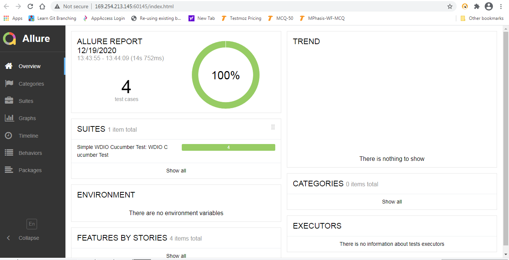
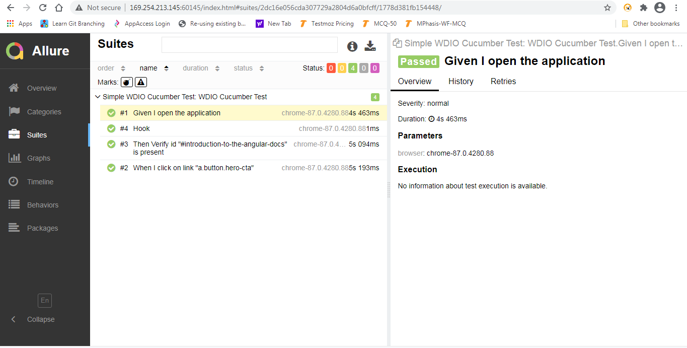
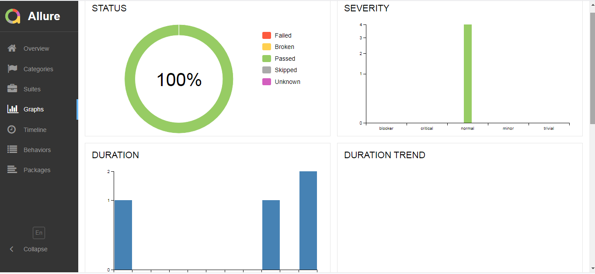

**WDIO GetStarted:**
* https://webdriver.io/docs/gettingstarted.html

**Plugins**
* Cucumber
* @rpii/wdio-html-reporter
* @wdio/allure-reporter

**Generate Allure Reports**
* allure generate allure-results && allure open

**Allure Report:**

  
  
  

